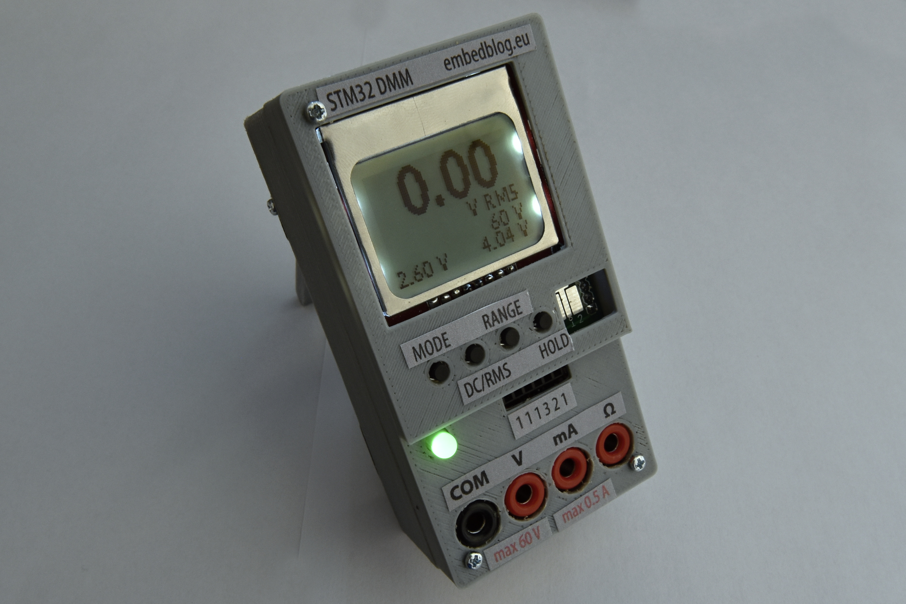

# STM32 OpenSource Multimeter
*see the article [here](http://embedblog.eu/dmm) or the video [here](https://www.youtube.com/watch?v=ohOqSMUoqBM)*

## Specs (revision 1.2 - latest stable; see below for 1.3)
1. voltage measurement: ±6 or ±60 V ranges, with DC or RMS data acquisition
2. current measurement: ±60 or ±500 mA ranges, again with DC or RMS
3. can measure voltage and current simultaneously and display the product, ie power
4. measures continuity and displays the resistance and voltage drop
5. can perform simple component testing

Additional features: hold function (freezes the display); isolated USB connection; buzzer; exposed I2C port; status LED.

## Additions (revision 1.3 - experimental)
1. two aditional voltage ranges, so now you have ±60 V, ±6 V, ±600 mV, ±60 mV
2. adjusted current ranges to ±200 mA or ±2 A, lowered burden voltage
3. other minor tweaks and improvements

