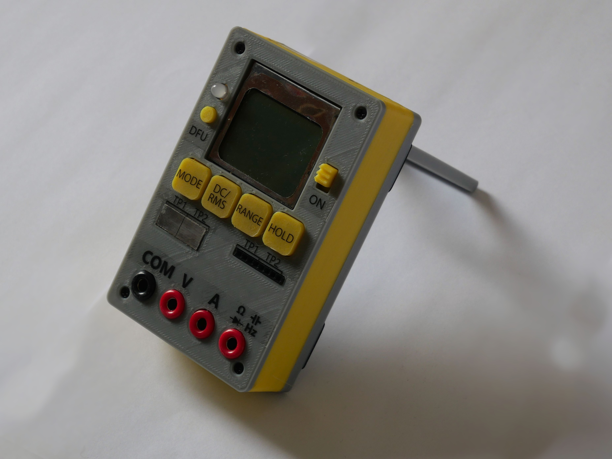

# STM32 OpenSource Multimeter
*see the article [here](http://embedblog.eu/?p=438) or the video [here](https://youtu.be/qQX5iS70-mg)*

## Specs (revision 1.5 - latest stable)
1. voltage measurement: ±60 V, ±6 V, ±600 mV, ±60 m ranges, with DC or RMS data acquisition
2. current measurement: ±250 or ±2500 mA ranges, again with DC or RMS
3. can measure voltage and current simultaneously and display the product, ie power
4. measures continuity and displays the resistance and voltage drop
5. can perform simple component testing
6. frequency measurement up to 10 MHz

Additional features: isolated USB serial port; ; 2 kB EEPROM; 4 bit expansion port; battery voltage measurement & charging via USB; firmware update via USB; integrated kickstand; hold function

*Note: when this project started, it used STM32F1. Now it uses STM32F3, but I cannot rename the repository, so I hope it won't mislead anyone.*
